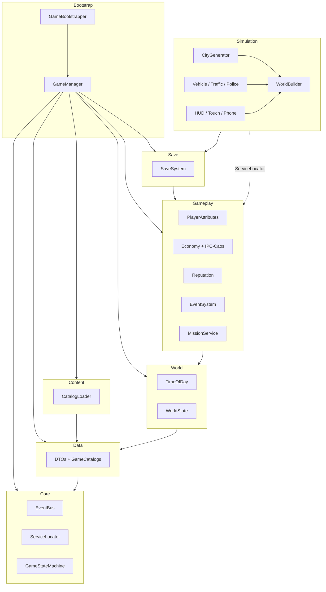

<p align="center">
  
</p>

<h1 align="center">Cidade do Caos</h1>

<p align="center">
  <strong>Sandbox urbano mobile · Unity 6 LTS · 100% brasileiro</strong><br/>
  Dirija, sobreviva e caia no caos de <em>São Genésio</em> — a metrópole fictícia onde o trânsito, a inflação e a PM nunca descansam.
</p>

<p align="center">
  <a href="https://unity.com/releases/editor/whats-new/6000.5.2"></a>
  <a href="docs/index.html"></a>
  <a href="docs/13-mvp-roadmap.md"></a>
  <a href="LICENSE"></a>
</p>

<p align="center">
  <a href="#-começar-em-5-minutos">Começar</a> ·
  <a href="#-o-que-é">O jogo</a> ·
  <a href="#-arquitetura">Arquitetura</a> ·
  <a href="docs/index.html">Portal do GDD</a> ·
  <a href="#-controles">Controles</a> ·
  <a href="CONTRIBUTING.md">Contribuir</a>
</p>

---

## O que é

**Cidade do Caos** é um sandbox urbano *mobile-first* ambientado em **São Genésio do Caos**: cidade brasileira gerada em runtime (960×960 m, 9 bairros), com direção Ackermann, trânsito na mão da direita, polícia, comércio, rádio sintetizada, missões encadeadas e economia com **IPC-Caos**.

Nada de assets importados de terceiros — **geometria, texturas e áudio nascem em código** no boot. Abra uma cena vazia, aperte Play.

| Pilares | Conteúdo atual (slice S1–S8) |
|---|---|
| Caos brasileiro como mecânica | 9 bairros · 46 logradouros · 70 buracos |
| Liberdade com consequência | Procurado 0–5★ · BUSTED / WASTED |
| Sobrevivência leve | Fome · **Sede** · Energia · Sanidade · Saúde |
| Mobile-first de verdade | Touch · 60 fps · static batching |
| Humor e identidade | 44 modelos reais · 6 rádios · 34 itens |

> GDD completo (canônico): [`docs/`](docs/README.md) · Portal interativo: [`docs/index.html`](docs/index.html)

---

## Começar em 5 minutos

**Requisitos:** [Unity Hub](https://unity.com/download) + **Unity 6** (`6000.5.2f1` recomendado) · Windows / macOS / Linux

```text
1. Unity Hub → Add → selecione esta pasta
2. Abra com Unity 6 (primeira importação baixa Packages/manifest.json)
3. Assets → Create → Scene → nomeie Bootstrap → abra
4. Play ▶
```

O boot sobe sozinho: `MobilePerf` → `GameBootstrapper` → `GameManager` → `WorldBuilder` → cidade + HUD + sistemas. Tempo típico de geração da cidade: ~1,5 s.

**Input:** `Project Settings → Player → Active Input Handling` = **Both** ou **Input Manager (Old)**.

<details>
<summary><strong>Build Android / iOS</strong></summary>

- Menu **Caos › Build › Configurar iOS + Android** (ou `CaosBuildSetup` no open do projeto).
- Bundle id: `com.caosstudio.cidadedocaos` · landscape · Android 7+ · iOS 14+.
- **Android:** builda no Windows. **iOS/IPA:** exige macOS + Xcode (ou Cloud Build / runner `macos`).

Detalhes: [docs/12-tecnologia-implementacao.md](docs/12-tecnologia-implementacao.md).

</details>

<details>
<summary><strong>Validar sem abrir o Editor</strong></summary>

```bash
"C:/Program Files/Unity/Hub/Editor/6000.5.2f1/Editor/Unity.exe" \
  -batchmode -quit -nographics \
  -projectPath "C:/caminho/GTA-Brasileiro" \
  -logFile "C:/caminho/GTA-Brasileiro/compile.log"
```

Play Mode headless (smoke): troque `-quit` por `-executeMethod Caos.EditorTools.CaosPlaySmoke.Run`.

</details>

---

## Arquitetura

Assemblies com dependências **unidirecionais** (grafo acíclico). Simulação acessa serviços via `ServiceLocator` — não depende do Bootstrap.



```
Assets/Scripts/
├── Caos.Core/         EventBus, ServiceLocator, ITickable, GameStateMachine, CaosLog/CaosMath/Random
├── Caos.Data/         DTOs + GameCatalogs
├── Caos.World/        TimeOfDay, WorldState
├── Caos.Gameplay/     Atributos, Economia, Reputação, Eventos, Missões
├── Caos.Content/      CatalogLoader  ← StreamingAssets/Data/*.json
├── Caos.Save/         SaveData + SaveSystem (JSON local)
├── Caos.Bootstrap/    GameManager (composition root + tick + autosave)
└── Caos.Simulation/   Cena jogável, cidade, veículos, UI, áudio
    └── City/          CityLayout, CityGenerator, Props, Palette, VehicleFactory

Assets/Tests/EditMode/ Testes das regras (rodam no Test Runner e também sem Unity)
```

| Camada | Engine? | Responsabilidade |
|---|---|---|
| **Core** | não | Infra compartilhada: eventos, serviços, log, matemática, sorteio |
| **Data** | não | Catálogos tipados (DTOs) |
| **World** | não | Relógio do mundo, clima, Caos, estrelas |
| **Gameplay** | não | Regras puras (atributos, economia, missões) |
| **Content** | sim | Leitura dos JSON de `StreamingAssets` |
| **Save** | sim | Persistência JSON local |
| **Simulation** | sim | MonoBehaviours, física, geração da cidade, UI |
| **Bootstrap** | sim | Composition root — única entrada do tick loop |

As quatro camadas de cima **não compilam contra `UnityEngine`** — é o que permite testá-las num
runner comum de .NET, sem licença de Unity:

```bash
python3 scripts/verificar_arquitetura.py                  # grafo unidirecional, núcleo sem engine
python3 tools/testes-sem-unity/gerar_projetos.py
dotnet test tools/testes-sem-unity/gerado/Caos.Testes/Caos.Testes.csproj
```

Os mesmos arquivos de teste rodam no **Test Runner** do Editor (`Window › General › Test Runner`).

Mais profundo: [docs/architecture.md](docs/architecture.md) · [docs/12-tecnologia-implementacao.md](docs/12-tecnologia-implementacao.md)

---

## Features do slice jogável

```text
🏙️  São Genésio   960×960 m · 9 bairros · malha com nome real
🚗  Frota         44 modelos reais com silhueta própria (Fusca → jamanta)
🚦  Trânsito      Mão da direita · semáforo · sanfona proporcional
👮  Polícia       Setores + antecipação de posição · 0–5★
🛒  Comércio      Padaria, boteco, lotérica, posto, oficina…
📻  Rádio         6 estações PCM sintetizadas (funk → gospel)
📍  Radar         Minimapa 12 Hz · blips · mapa grande · rota GPS
📱  Mobile        Joystick + arco de ações · Device Simulator ok
📜  Missões       17 encadeadas · tutorial + beacon + linha no mapa
🚶  Corpo         Cápsulas · joelho e cotovelo dobrando · agachar/sentar
💾  Save          3 slots · menu inicial · autosave + pausa
```

**Catálogos** em `Assets/StreamingAssets/Data/`:

| Arquivo | Conteúdo |
|---|---|
| `vehicles.json` | 44 fichas (massa, cv, km/L, tanque) |
| `items.json` | 34 itens (pastel → botijão P13), com fome **e sede** |
| `shops.json` | 32 estabelecimentos com bordão |
| `radio.json` | 6 estações + locutores |
| `events.json` | 24 eventos (enchente, blitz, carnaval…) |
| `missions.json` | 17 missões com pré-requisitos (M00 = tutorial) |
| `districts.json` / `streets.json` / `factions.json` | Geografia + facções |

---

## Controles

| Tecla | Ação |
|---|---|
| `WASD` / setas | Andar · Acelerar / esterçar |
| `Shift` | Correr (drena energia) |
| `Espaço` | Pular · Freio |
| `Ctrl` / `C` | Agachar · Freio de mão |
| `E` | Entrar / sair do veículo |
| `F` | Usar estabelecimento próximo |
| `G` | Sentar / levantar (banco de praça, ponto) |
| `H` | Buzina |
| `R` | Abastecer |
| `P` | Celular |
| `Q` / `Z` | Estação de rádio · on/off |
| `M` | Mapa grande |
| `Tab` / `Esc` | Pausa |
| Botão direito + mouse | Orbitar câmera |

**Touch:** joystick esquerdo · arco direito **FREIO / E / F** · fileira **CORRER / AGACHAR / SENTAR** · coluna **R / RÁDIO / FONE / II**.

---

## Roadmap

| Sprint | Status | Entrega |
|---|---|---|
| S1–S3 | ✅ | Personagem, dia/noite, 1º veículo + combustível |
| S4–S6 | ✅ | HUD, tráfego, polícia, touch, busted/wasted |
| S7–S8 | ✅ | Missões UI, áudio, cidade BR completa, rádio, radar |
| **S9** | 🔲 | Arte final / LOD / Addressables · DOTS tráfego · interiores |

Detalhe: [docs/13-mvp-roadmap.md](docs/13-mvp-roadmap.md)

---

## Documentação

| Recurso | Link |
|---|---|
| **Portal interativo (GDD)** | [docs/index.html](docs/index.html) |
| Bíblia do Mundo (fonte de verdade) | [docs/00-biblia-do-mundo.md](docs/00-biblia-do-mundo.md) |
| Arquitetura técnica | [docs/architecture.md](docs/architecture.md) |
| Como contribuir | [CONTRIBUTING.md](CONTRIBUTING.md) |
| Segurança | [SECURITY.md](SECURITY.md) |
| Changelog | [CHANGELOG.md](CHANGELOG.md) |

---

## Licença e marcas

Código sob [MIT](LICENSE). Marcas de veículo, comércio, rádio e facção são **paródias fictícias** (Fiasco, Volksmann, Chevalier…). Sem modelos 3D ou áudio de terceiros — tudo gerado em runtime.

---

<p align="center">
  <sub>CaosStudio · São Genésio nunca dorme</sub>
</p>
